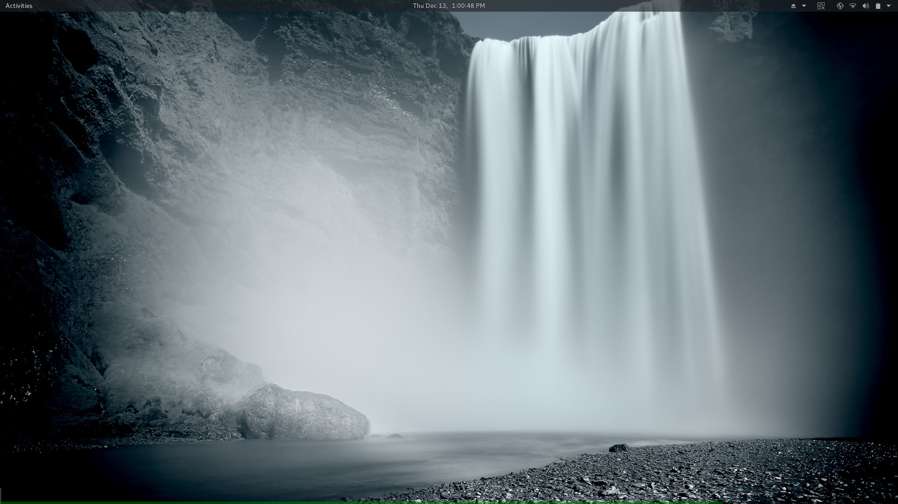
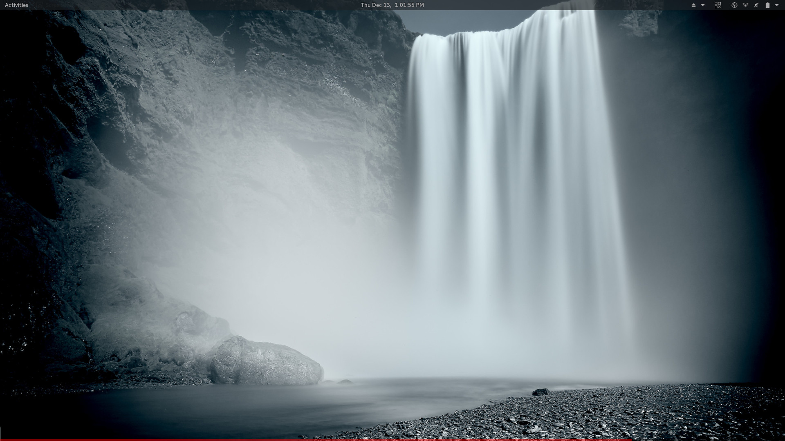

Table of contents
=================
<!--ts-->
   * [Volux](#volux)
      * [Purpose](#purpose)
         * [What does it do?](#what-does-it-do)
         * [What <em>will</em> it do?](#what-will-it-do)
         * [Screenshots](#screenshots)
         * [Supported platforms](#supported-platforms)
      * [Installation](#installation)
         * [Requirements](#requirements)
         * [Install via pip](#install-via-pip)
         * [Install via wheel (.whl)](#install-via-wheel-whl)
         * [Build from source](#build-from-source)
      * [Using Volux](#using-volux)
         * [Modes](#modes)
         * [Volume/brightness](#volumebrightness)
         * [Exit](#exit)
      * [Issues and bugs](#issues-and-bugs)
<!--te-->
_( generated by [gh-md-toc](https://github.com/ekalinin/github-markdown-toc) )_

# Volux 
| BRANCH  | BUILD | COVERAGE | REQUIREMENTS | ISSUES | OPEN PRs |
| ---     | ---          | ---      | ---          | ---    | ---      |
| Master  |  |  |  |  |  |
| Develop |  |  | 

## Purpose
Volux is an application written in Python 3 aimed at media powerusers.

### What does it do?
Volux allows you to perform many media operations quickly using just your mouse/touchpad.

All interactions are registered when hovering over the Volux bar on your screen.

- Increase/decrease volume using scroll
- Mute/unmute using middle-click

### What _will_ it do?
Features in development / planned for development
- Brightness control via mouse wheel
- Interface customisation

### Screenshots

| Mode                | State    | Image |
| :---:               | :---:    | :---: |
| Volume (active)     | active   |  |
| Volume (inactive)   | inactive |  |
| Mute (active)       | active   |  |
| Brightness (active) | active   |  |

### Supported platforms

&nbsp;&nbsp; Windows 7 or later

&nbsp;&nbsp; MacOS

&nbsp;&nbsp; Linux (most distributions)

## Installation
### Requirements

    $ sudo apt-get install python3-tk python3-xlib python3-dbus libasound2-dev

### Install via pip
Install as user (recommended):

    $ pip3 install volux --user

Install as root:

    $ sudo pip3 install volux

### Install via wheel (.whl)
Install as user (recommended):

    $ pip3 install volux-*-py3-none-any.whl --user
    
Install as root:

    $ sudo pip3 install volux-*-py3-none-any.whl

### Build from source
Clone this repository:

    $ git clone https://github.com/DrTexxOfficial/volux.git

Install pip requirements:

    $ cd volux
    $ pip3 install -r requirements.txt --user

Build:

    $ python3 setup.py bdist_wheel

## Using Volux
All interactions with Volux are only valid when hovering over the bar Volux produces. This allows you to interact with Volux without loosing your ability to use your scroll bar in other applications.

### Modes
To cycle between modes in Volux, right-click the main bar. By default, a green bar signifies volume mode and a blue bar signifies brightness mode (wip).

### Volume/brightness
While in volume or brightness mode, scroll up/down to increase/decrease volume or brightness while hovering over the main bar.

### Exit
To exit Volux, double right-click the bar at any time.

## Issues and bugs
If you have any problems running Volux, please kindly post an issue to this repository. Issues can be solved much faster if you can provide:

- Your OS
- Your desktop environment (if using Linux)
- A Summary of issues experienced
- Any relevant screenshot/s

Volux is developed under Debian 9 Stretch (Linux) using GNOME 3.22.2 and Python 3.5. Providing you've correctly installed all dependencies, Volux is almost guranteed to work under these conditions.

Additional testing has been done under these conditions:

| Operating System | Desktop Environment | Python Version | Status  | Notes                  |
| ---              | ---                 | ---            | ---     | ---                    |
| Debian 9 Stretch | Gnome 3.22.2        | 3.5            | Working | Development conditions |
| Ubuntu _ver=?_   | Gnome _ver=?_       | 3.6            | Working |                        |
| Windows 10       | N/A                 | 3.7            | Broken  | Dependency issues      |

 

